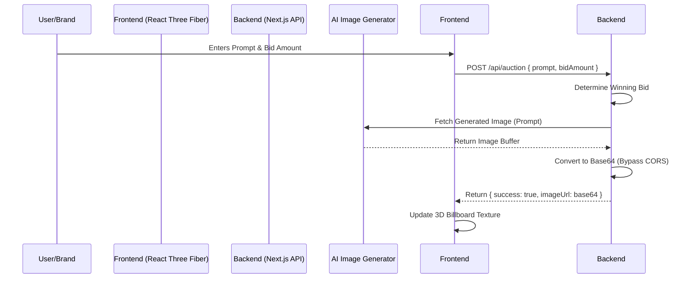

# AdVerse

**AdVerse** is a dynamic, real-time auction platform for digital billboards in 3D virtual environments. 

## 🚀 The Problem We're Solving

In traditional gaming and virtual environments, advertisements are static, hard-coded textures that require game patches to update. This makes advertising campaigns rigid and inefficient for brands, and immersion-breaking for players. 

**AdVerse** solves this by turning any 3D surface into a live auction house. Brands and users can submit bids accompanied by AI-generation prompts. The highest bidder wins the slot, and their prompt is instantly converted into a high-quality ad via an AI image generator, which is then streamed directly onto the in-game billboard in real time.

## 💸 Sub-cent Economics & x402 Payments

**Tiny payments for agent actions**
Each bid endpoint can issue an x402 payment requirement. The buyer agent signs a Circle Gateway authorization, retries the request, and arcAd(e) records the receipt before accepting the bid.

A bid can cost fractions of a cent without turning into a settlement problem.

- **Agent-native flow:** No checkout UI: the agent receives a challenge, signs, and continues.
- **Auditable receipts:** Every paid action can carry payer, amount, network, asset, and verification data.

### x402 Authorization Details
| Field | Value |
|-------|-------|
| **NETWORK** | `eip155:5042002` |
| **ASSET** | Arc Testnet USDC |
| **ACTION** | bid / increase |
| **PAYER** | agent wallet |
| **VERIFICATION** | `isValid: true` |

## 🛠 Tech Stack

- **Frontend:** Next.js 14, React, Tailwind CSS
- **3D Environment:** Three.js, React Three Fiber, React Three Drei
- **Backend:** Next.js Serverless API Routes
- **AI Integration:** Pollinations.ai (Dynamic Text-to-Image Generation)

## 📐 Architecture Diagram



## 💻 Running Locally

1. Clone the repository:
   ```bash
   git clone https://github.com/anushkagupta200615-jpg/AdVerse.git
   ```
2. Install dependencies:
   ```bash
   npm install
   ```
3. Start the development server:
   ```bash
   npm run dev
   ```
4. Open [http://localhost:3000](http://localhost:3000) in your browser.

## ☁️ Deployment

AdVerse is built on Next.js, making it 100% compatible with **Vercel**. 
Simply import this repository into your Vercel dashboard for a zero-configuration, globally distributed serverless deployment!
